# CA-Wizard — Entity Relationship Diagram

## Mermaid ERD

```mermaid
erDiagram
    SCHOOLS ||--o{ PROFILES : "employs"
    SCHOOLS ||--o{ SESSIONS : "has"
    SCHOOLS ||--o{ STUDENTS : "enrolls"
    SCHOOLS ||--o{ CLASS_LEVELS : "defines"
    SCHOOLS ||--o{ CLASS_ARMS : "defines"
    SCHOOLS ||--o{ ASSESSMENT_CATEGORIES : "configures"
    SCHOOLS ||--o{ GRADING_SYSTEMS : "configures"
    SCHOOLS ||--o{ INVITE_CODES : "issues"

    SESSIONS ||--o{ TERMS : "contains"
    SESSIONS ||--o{ CLASSES : "runs"

    CLASS_LEVELS ||--o{ CLASSES : "instantiates"
    CLASS_ARMS ||--o{ CLASSES : "instantiates"
    CLASS_LEVELS ||--o{ SUBJECTS : "offers"

    CLASSES ||--o{ STUDENT_ENROLLMENTS : "has"
    STUDENTS ||--o{ STUDENT_ENROLLMENTS : "enrolled_in"

    CLASSES ||--o{ TEACHER_ASSIGNMENTS : "assigned_to"
    PROFILES ||--o{ TEACHER_ASSIGNMENTS : "teaches"
    SUBJECTS ||--o{ TEACHER_ASSIGNMENTS : "covered_by"

    GRADING_SYSTEMS ||--o{ GRADE_RANGES : "defines"

    STUDENTS ||--o{ STUDENT_SCORES : "scores"
    SUBJECTS ||--o{ STUDENT_SCORES : "scored_in"
    TERMS ||--o{ STUDENT_SCORES : "recorded_in"
    ASSESSMENT_CATEGORIES ||--o{ STUDENT_SCORES : "categorized_by"

    STUDENTS ||--o{ EXAM_SCORES : "exam_scores"
    SUBJECTS ||--o{ EXAM_SCORES : "exam_in"
    TERMS ||--o{ EXAM_SCORES : "exam_term"

    STUDENTS ||--o{ ATTENDANCE : "tracked"
    STUDENTS ||--o{ AFFECTIVE_SCORES : "rated"
    STUDENTS ||--o{ PSYCHOMOTOR_SCORES : "rated"
    STUDENTS ||--o{ COMMENTS : "receives"
    STUDENTS ||--o{ REPORT_SNAPSHOTS : "generates"

    AFFECTIVE_METRICS ||--o{ AFFECTIVE_SCORES : "measured_by"
    PSYCHOMOTOR_METRICS ||--o{ PSYCHOMOTOR_SCORES : "measured_by"

    PROFILES ||--o{ AUDIT_LOGS : "performs"

    SCHOOLS {
        uuid id PK
        text name
        text slug UK
        enum status
        text subscription_tier
    }

    PROFILES {
        uuid id PK
        uuid user_id FK "auth.users"
        uuid school_id FK
        enum role
        text first_name
        text last_name
        text email
    }

    SESSIONS {
        uuid id PK
        uuid school_id FK
        text name
        int start_year
        int end_year
        bool is_current
    }

    TERMS {
        uuid id PK
        uuid school_id FK
        uuid session_id FK
        enum name
        bool is_current
        bool is_published
        bool is_locked
    }

    CLASS_LEVELS {
        uuid id PK
        uuid school_id FK
        text name
        int order_index
    }

    CLASS_ARMS {
        uuid id PK
        uuid school_id FK
        text name
    }

    CLASSES {
        uuid id PK
        uuid school_id FK
        uuid session_id FK
        uuid class_level_id FK
        uuid class_arm_id FK
        uuid form_teacher_id FK
    }

    SUBJECTS {
        uuid id PK
        uuid school_id FK
        uuid class_level_id FK
        text name
        text code
    }

    STUDENTS {
        uuid id PK
        uuid school_id FK
        text admission_number UK
        text first_name
        text last_name
        enum gender
        date date_of_birth
    }

    STUDENT_ENROLLMENTS {
        uuid id PK
        uuid student_id FK
        uuid class_id FK
        uuid session_id FK
    }

    TEACHER_ASSIGNMENTS {
        uuid id PK
        uuid teacher_id FK
        uuid class_id FK
        uuid subject_id FK
        enum scope
    }

    ASSESSMENT_CATEGORIES {
        uuid id PK
        uuid school_id FK
        text name
        numeric max_score
    }

    GRADING_SYSTEMS {
        uuid id PK
        uuid school_id FK
        text name
        bool is_default
    }

    GRADE_RANGES {
        uuid id PK
        uuid grading_system_id FK
        text grade
        numeric min_score
        numeric max_score
        text remark
    }

    STUDENT_SCORES {
        uuid id PK
        uuid student_id FK
        uuid subject_id FK
        uuid term_id FK
        uuid assessment_category_id FK
        numeric score
        bool is_synced
    }

    EXAM_SCORES {
        uuid id PK
        uuid student_id FK
        uuid subject_id FK
        uuid term_id FK
        numeric score
        numeric max_score
    }

    ATTENDANCE {
        uuid id PK
        uuid student_id FK
        uuid term_id FK
        int days_present
        int days_absent
    }

    AFFECTIVE_METRICS {
        uuid id PK
        uuid school_id FK
        text name
    }

    PSYCHOMOTOR_METRICS {
        uuid id PK
        uuid school_id FK
        text name
    }

    AFFECTIVE_SCORES {
        uuid id PK
        uuid student_id FK
        uuid metric_id FK
        uuid term_id FK
        enum rating
    }

    PSYCHOMOTOR_SCORES {
        uuid id PK
        uuid student_id FK
        uuid metric_id FK
        uuid term_id FK
        enum rating
    }

    COMMENTS {
        uuid id PK
        uuid student_id FK
        uuid term_id FK
        text teacher_comment
        text management_comment
    }

    REPORT_SNAPSHOTS {
        uuid id PK
        uuid student_id FK
        uuid term_id FK
        jsonb snapshot_data
        text pdf_url
    }

    INVITE_CODES {
        uuid id PK
        uuid school_id FK
        text code UK
        enum scope
        bool is_active
        timestamptz expires_at
    }

    AUDIT_LOGS {
        uuid id PK
        uuid school_id FK
        uuid user_id FK
        enum action
        text entity_type
    }
```

## Key Design Decisions

**1. Tenant Isolation Strategy**
Every table that holds school-specific data carries a `school_id` column directly (denormalized from the parent chain). This is intentional: it allows every RLS policy to be a single flat `school_id = current_school_id()` check instead of multi-hop joins, which keeps Postgres query plans fast and RLS policies simple to audit.

**2. Why `student_scores` is separate from `exam_scores`**
CA components (Classwork, Homework, Quiz, Assignment) are entered incrementally throughout a term by potentially different actions, while the Exam is a single terminal score entered once. Splitting them lets the "lock term" operation freeze exam entry independently and lets us audit/recompute the CA total via the `v_ca_broadsheet` view without scanning irrelevant exam rows.

**3. Score computation via Postgres views, not application code**
`v_ca_broadsheet` and `v_term_results` compute aggregates at the database layer. This guarantees the broadsheet, report card, and any future analytics endpoint all derive numbers from one source of truth — eliminating drift between "what the teacher sees" and "what's printed on the report card."

**4. `report_snapshots.snapshot_data` (JSONB)**
Once a term is published, generating a student's report card writes an immutable JSON snapshot of every score, grade, comment, and attendance figure at that moment. This protects historical report cards from being silently altered by later data corrections — a requirement explicit in the brainstorm ("historical session preservation").

**5. Offline-first teacher workflow**
`student_scores.is_synced` and `exam_scores.is_synced` flag rows written while offline. The IndexedDB layer (`src/lib/idb.ts`) queues these locally; on reconnect, a sync worker pushes pending rows and flips `is_synced = true`. RLS still enforces `term.is_locked = false` server-side, so a teacher cannot bypass a term lock by queuing writes offline and syncing later — sync attempts against a locked term are rejected by Postgres, not just the UI.

**6. Invite codes carry scope**
An invite code can target a whole class (`CLASS` scope, e.g. a form teacher) or a single subject within a class (`SUBJECT` scope, e.g. a subject specialist). On redemption, a `teacher_assignments` row is created automatically, removing the need for school admins to manually assign teachers after invite.
